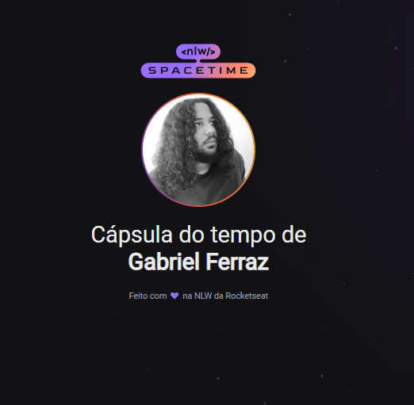

<strong><h1 align="center"> DevLinks </h1></strong>

  

<h1> Projeto </h1> 
O projeto é uma capsula do tempo, um lugar para guardar memórias. A página é interativa e responsiva, sendo atualizada periodicamente. 

## Tecnologias 

Esse projeto foi desenvolvido com as seguintes tecnologias 

- HTML 
- CSS
- Git e Github

## Layout
Você pode visualizar esse projeto através [desse link](https://nlw-spacetime-gabrielferrazdev.vercel.app).